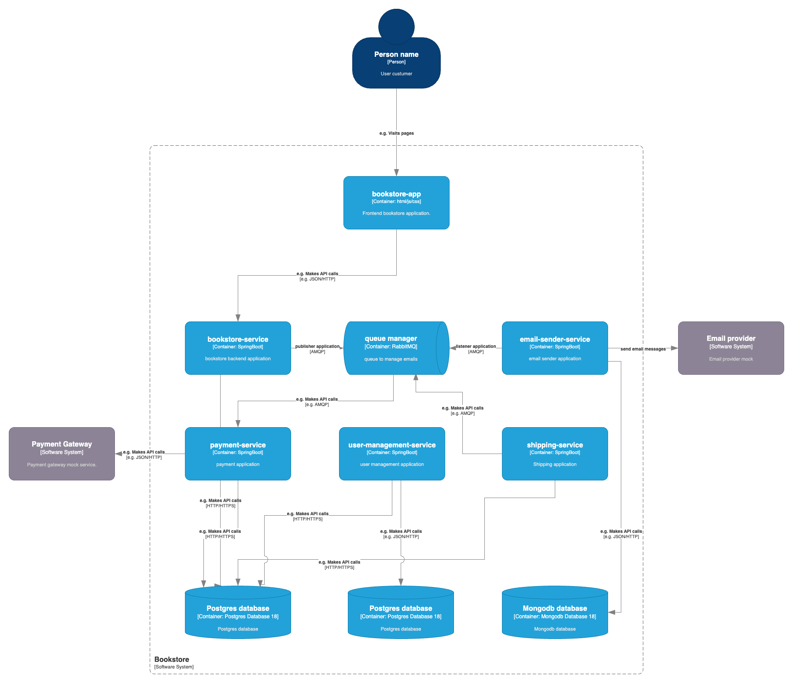

## 🧪 Microservices Labs

This project is a sandbox environment created to study, experiment, and demonstrate modern practices within a microservices architecture.
It brings together multiple Spring Boot–based microservices to simulate a realistic production ecosystem.
The environment is fully containerized with Docker Compose

## 🎯 Goals

This lab serves as a foundation for exploring:
	•	Microservices communication patterns (REST, messaging with RabbitMQ, etc.)
	•	Software architecture approaches

## 🚀 Overview

In short, this project provides a **hands-on learning platform** to explore how microservice systems works in real project. It is **not a production-ready solution**; instead, it serves as a **base project** that can be used to study and experiment with topics relevant to environments similar to those found in a professional setting.

### Project Structure

```
root
├── applications
│   ├── Frontend
│       ├── Bookstore app        # site for bookstore
│       └── Dashboard app        # site with all links to applications configured in this docker-compose file.
│   ├── Backends
│       ├── bookstore            # Spring Boot application for bookstore api
│       ├── email-sender         # Spring Boot application for sending emails
│       ├── payments             # Spring Boot application for managing payments
│       ├── shipping             # Spring Boot application for managing shippings
│       └── user-management      # Spring Boot application for user management
└── infrastructure
	├── postgresql           # PostgreSQL 18 database
	├── mongodb              # mongodb database
	├── Redis                # Redis database
	├── Rabbitmq             # RabbitMQ message broker
	├── Kafka                # Kafka Broker
	├── Kafka Connect		 # Kafka Connect
	├── Kafka UI             # Kafka GUI
	├── Mailhog              # Mail testing tool
	└── Mockoon              # Fake api to mock request
```

## Pre-requisites

Before running the project, make sure you have installed:

- **Java 21** (required only to execute applications in IDE)  
- **Docker** (to run applications and infrastructure services)


## Running the Project

All applications and infrastructure services are designed to run using Docker Compose. You can find the docker-compose files in ***infrastructure/docker*** folder. Inside ***infrastructure/scripts*** folder execute to build the Java applications and start all application using docker-compose:

```bash
sh start.sh build
```

The build attribute is necessary to build the microservices applications. After the images were built execute:

```bash
sh start.sh
```

To stop all applications execute the following script:
```bash
sh stop.sh
```

## Accessing the Applications

Once the containers are running, you can access the services the Dashboard application: http://localhost. There's also a healthcheck in this page to check if all applications are online. Some services can take a time to be available.

## Setting up kafka connect connections

After Kafka connection was started, from ***scripts*** directory
run the command to configure the connections used by kafka connect.

````
sh setup-kafka-connect-connections.sh
````

Check if the connections were successfully created by accessing the Kafka Connectors

````
http://localhost:9094/connectors
````


### Project diagram

