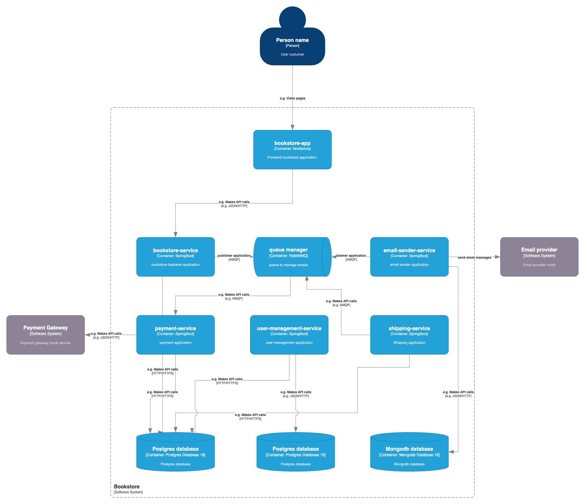

# 🧪 Microservices Labs

This project is a sandbox environment created to study, experiment, and demonstrate modern practices within a microservices architecture. It brings together multiple Spring Boot–based microservices to simulate a realistic production ecosystem. The environment is fully containerized with Docker Compose.

## 📑 Table of Contents

- [🎯 Goals](#-goals)
- [🚀 Overview](#-overview)
- [📁 Project Structure](#-project-structure)
- [🔧 Prerequisites](#-prerequisites)
- [🚀 Quick Start](#-quick-start)
- [🌐 Accessing Applications](#-accessing-applications)
- [🔗 Kafka Connect Setup](#-kafka-connect-setup)
- [📖 Development Guide](#-development-guide)
- [🏗️ Architecture](#-architecture)
- [🐛 Troubleshooting](#-troubleshooting)

## 🎯 Goals

This lab serves as a foundation for exploring:
- **Microservices communication patterns** (REST, messaging with RabbitMQ, etc.)
- **Software architecture approaches**
- **Event-driven architectures** with Kafka
- **Database integration patterns** (PostgreSQL, MongoDB, Redis)
- **Container orchestration** with Docker Compose

## 🚀 Overview

In short, this project provides a **hands-on learning platform** to explore how microservice systems work in real projects. It is **not a production-ready solution**; instead, it serves as a **base project** that can be used to study and experiment with topics relevant to environments similar to those found in professional settings.

## 📁 Project Structure

```
root
├── Makefile                    # Build automation and convenience commands
├── applications
│   ├── Frontend
│   │   ├── Bookstore app        # Html-based bookstore website
│   │   └── Dashboard app        # Service dashboard with health checks
│   └── Backends
│       ├── bookstore            # Spring Boot application for bookstore API
│       ├── email-sender         # Spring Boot application for email notifications
│       ├── payments             # Spring Boot application for payment processing
│       ├── shipping             # Spring Boot application for shipping management
│       └── user-management      # Spring Boot application for user management
└── infrastructure
	├── postgresql           # PostgreSQL 18 database
	├── mongodb              # MongoDB database
	├── redis                # Redis cache
	├── rabbitmq             # RabbitMQ message broker
	├── kafka                 # Apache Kafka broker
	├── kafka-connect          # Kafka Connect for CDC
	├── kafka-ui              # Kafka management GUI
	├── mailhog              # Email testing tool
	└── mockoon              # API mocking tool
```

## 🔧 Prerequisites

Before running the project, ensure you have installed:

- **Java 21** (required for IDE execution)
- **Docker** (required for running applications and infrastructure)
- **Docker Compose** (included with Docker Desktop)
- **Make** (optional, for convenient commands)

## 🚀 Quick Start

### Method 1: Using Makefile (Recommended)

The project includes a **Makefile** at the root level for convenient commands:

```bash
# Build and start all services (first time setup)
make start-build

# Start existing services (quick restart)
make start

# Stop all running containers
make stop

# Setup Kafka Connect connections
make setup-kafka-connect

# Show available commands
make help
```

### Method 2: Manual Script Usage

All applications and infrastructure services are designed to run using Docker Compose. You can find docker-compose files in the `infrastructure/docker/` folder.

```bash
# Build and start all services
cd infrastructure/scripts && ./start.sh build

# Start existing services
cd infrastructure/scripts && ./start.sh

# Stop all services
cd infrastructure/scripts && ./stop.sh
```

## 🌐 Accessing Applications

Once containers are running, you can access services through the main **Dashboard application** at `http://localhost`. The dashboard includes:

- **Service health checks** - Monitor if all applications are online
- **Quick access links** - Direct URLs to each microservice
- **System status** - Overall infrastructure health

> **Note**: Some services may take time to initialize on first startup. Check the dashboard for real-time status.

## 🔗 Kafka Connect Setup

### Method 1: Using Makefile (Recommended)

```bash
make setup-kafka-connect
```

### Method 2: Manual Script Usage

After Kafka is running, configure connections used by Kafka Connect:

```bash
cd infrastructure/scripts && ./setup-kafka-connect-connections.sh
```

### Verification

Check if connections were successfully created by accessing the Kafka Connect UI:

```bash
# Kafka Connectors Management
http://localhost:9094/connectors
```

## 📖 Development Guide

### Working with Individual Services

Each microservice can be run independently for development:

```bash
# Example: Run bookstore service only
cd applications/bookstore && ./mvnw spring-boot:run

# Example: Run payments service only
cd applications/payments && ./mvnw spring-boot:run
```

### Database Access

- **PostgreSQL**: `localhost:5432` (bookstore, payments, shipping, user-management)
- **MongoDB**: `localhost:27017` (general purpose)
- **Redis**: `localhost:6379` (caching layer)

### Message Brokers

- **RabbitMQ Management**: `http://localhost:15672`
- **Kafka UI**: `http://localhost:9021`
- **Kafka Topics**: Available via Kafka UI

## 🏗️ Architecture

### Data Flow

1. **User Actions** → Bookstore Service
2. **Order Processing** → Payments Service
3. **Payment Events** → Shipping Service
4. **Shipping Events** → Email Service
5. **Event Streaming** → Kafka Connect → Other Systems

### Technology Stack

- **Backend**: Spring Boot 3.x, Java 21
- **Databases**: PostgreSQL 18, MongoDB, Redis
- **Messaging**: RabbitMQ, Apache Kafka
- **Containerization**: Docker, Docker Compose
- **Event Sourcing**: Debezium CDC with Kafka Connect

## 🐛 Troubleshooting

### Getting Help

- **Service Logs**: Use `docker-compose logs <service-name>`
- **Container Status**: Use `docker-compose ps`
- **Network Issues**: Check `docker network ls`
- **Makefile Issues**: Run `make help` for available commands

---

## 📊 Project Diagram



---

**🎓 Happy Learning!** This project is designed to be a safe environment for experimentation and learning about microservices architecture.
